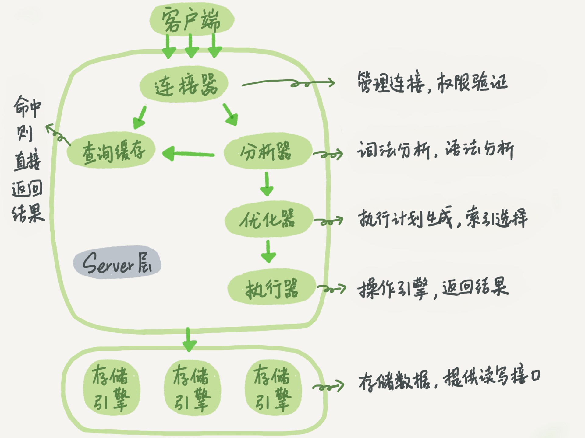

# MySQL实战45讲对数笔记

## 目录

* 基础篇
    1. 基础架构：一条SQL查询语句是如何执行的？
    2. 日志系统：一条SQL更新语句是如何执行的？
    3. 事务隔离：为什么你改了我还看不见？
    4. 深入浅出索引（上）
    5. 深入浅出索引（下）
    6. 全局锁和表锁：给表加个字段怎么有这么多阻碍？
    7. 行锁功过：怎么减少行锁对性能的影响？
    8. 事务到底是隔离的还是不隔离的？

* 实践篇
    1. 09丨普通索引和唯一索引，应该怎么选择？
    2. 10丨MySQL为什么有时候会选错索引？
    3. 11丨怎么给字符串字段加索引？
    4. 12丨为什么我的MySQL会“抖”一下？
    5. 13丨为什么表数据删掉一半，表文件大小不变？
    6. 14丨count这么慢，我该怎么办？
    7. 16丨“orderby”是怎么工作的？
    8. 17丨如何正确地显示随机消息？
    9. 18丨为什么这些SQL语句逻辑相同，性能却差异巨大？
    10. 19丨为什么我只查一行的语句，也执行这么慢？
    11. 20丨幻读是什么，幻读有什么问题？
    12. 21丨为什么我只改一行的语句，锁这么多？
    13. 22丨MySQL有哪些“饮鸩止渴”提高性能的方法？
    14. 24丨MySQL是怎么保证主备一致的？
    15. 25丨MySQL是怎么保证高可用的？
    16. 26丨备库为什么会延迟好几个小时？
    17. 27丨主库出问题了，从库怎么办？
    18. 28丨读写分离有哪些坑？
    19. 29丨如何判断一个数据库是不是出问题了？
    20. 31丨误删数据后除了跑路，还能怎么办？
    21. 32丨为什么还有kill不掉的语句？
    22. 33丨我查这么多数据，会不会把数据库内存打爆？
    23. 34丨到底可不可以使用join？
    24. 35丨join语句怎么优化？
    25. 36丨为什么临时表可以重名？
    26. 37丨什么时候会使用内部临时表？
    27. 38丨都说InnoDB好，那还要不要使用Memory引擎？
    28. 39丨自增主键为什么不是连续的
    29. 40丨insert语句的锁为什么这么多？
    30. 41丨怎么最快地复制一张表？
    31. 42丨grant之后要跟着flushprivileges吗？
    32. 43丨要不要使用分区表？
    33. 44 答疑文章（三）：说一说这些好问题
    34. 45丨自增id用完怎么办？

* 答疑篇
    1. 15丨答疑文章（一）：日志和索引相关问题
    2. 30丨答疑文章（二）：用动态的观点看加锁
    3. 44丨答疑文章（三）：说一说这些好问题
* 特别放送
    直播回顾丨林晓斌：我的MySQL心路历程
* 结束语
    结束语丨点线网面，一起构建MySQL知识网络

1. 基础架构：一条SQL查询语句是如何执行的？
    * SQL 语句在 MySQL 的各个功能模块中的执行过程。
    
    MySQL 可以分为 Server 层和存储引擎层两部分。
    * Server 层
    Server 层包括连接器、查询缓存、分析器、优化器、执行器等，涵盖 MySQL 的大多数核心服务功能，以及所有的内置函数（如日期、时间、数学和加密函数等），所有跨存储引擎的功能都在这一层实现，比如存储过程、触发器、视图等。
    * 存储引擎层
    而存储引擎层负责数据的存储和提取。其架构模式是插件式的，支持 InnoDB、MyISAM、Memory 等多个存储引擎。现在最常用的存储引擎是 InnoDB，它从 MySQL 5.5.5 版本开始成为了**默认**存储引擎。
    * 不同存储引擎的表数据存取方式不同，支持的功能也不同。
    * 连接器