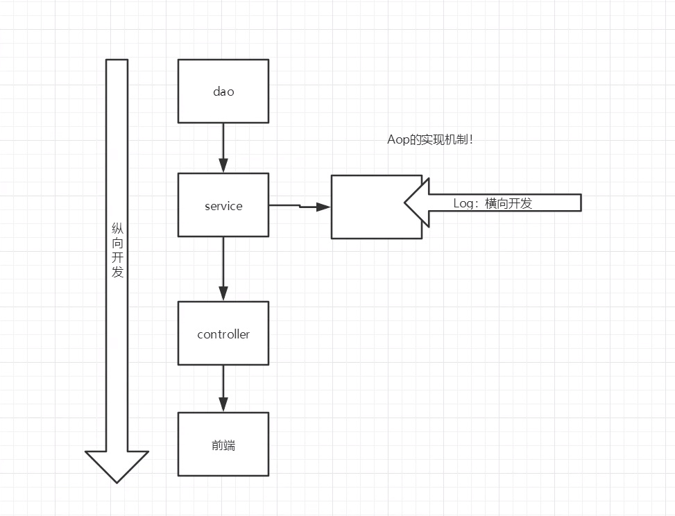

OOP（Object Oriented Progarmming，面向对象编程）是一种使用封装、继承、多态将业务处理过程抽象为一个个清晰的层级结构的编程思想。
  AOP（Aspect Oriented Programming，面向切面编程）是一种通过分离横切关注点（cross-cutting concerns）来维持程序模块化的编程思想。
  AOP是OOP的补充和完善，AOP更关注业务处理中的横切步骤或阶段，将影响多个步骤的横切步骤从核心业务模块单元单独提炼出来，命名为切面（Aspect），降低了横切步骤的侵入性。比如将日志、安全控制、异常处理、拦截点作为横切关注点单独提出，既有利于单独维护，又不会改动原有的业务模块。静态代理和动态代理都是实现AOP编程的方法。
