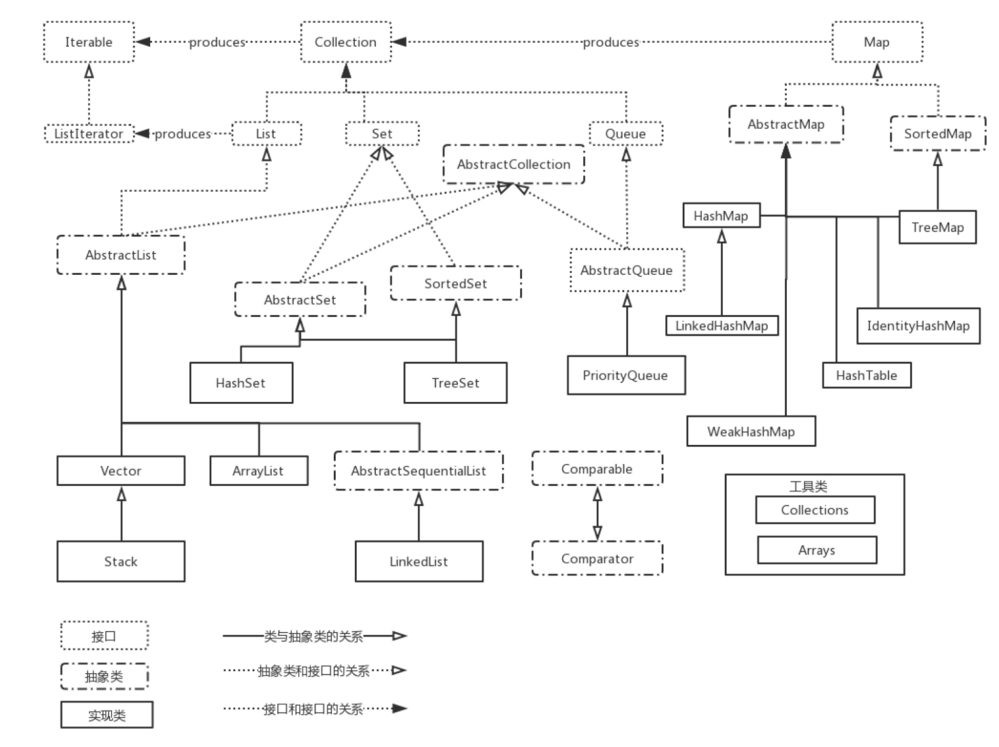

# Java基础的一些记录

## 数据类型

1. 四类八种：
    * 整型：byte̵ short̵ int̵ long
    * 浮点型：float double
    * 字符型：char
    * 布尔型：boolean
2. 基本数据类型的初始化值
    * boolean : false
    * char    : /u0000
    * byte    : (byte)0
    * short   : (short)0
    * int     : 0
    * long    : 0L
    * float   : 0.0f
    * double  : 0.0d
    其他对象初始化(String) :null

## 构造器

JVM会默认添加一个无参构造器，但是若手动定义了任何一个构造方法，JVM不再为你提供默认的构造器，你必须手动指定

## 重载与重写

* 重载：
  * 方法名称必须相同
  * 参数列表必须不同（个数不同、或类型不同、或参数类型排列顺序不同等）
  * 方法的返回值可以相同也可以不相同
  * **仅仅返回类型不同不足以成为方法的重载**
  * 重载是发生再编译时，因为编译器可以根据参数的类型来选择使用哪个方法

* 重写：
  * 重写的方法必须要和父类保持一致，包括返回值类型，方法名，参数列表
  * 重写的方法可以使用@Override 注解标识
  * 子类中重写

## 初始化顺序

* 静态属性:static开头定义的属性
* 静态方法块:static{}包起来的代码块
* 普通属性:非static定义的属性
* 普通方法块:{}包起来的代码块
* 构造函数:类名相同的方法

## 数组初始化

1. 定义
    * int[] a1
    * int a1[]
2. 带赋值的初始化
    * 质结构每个元素赋值  int array[4]={1,2,3,4}
    * 给一部分赋值,后面的都为0: int array[4]={1,2}
    * 有赋值参数个数决定数组的个数 int array[ ]={1,2}

## this 和 super

* this 表示当前对象,可以调用方法,调用属性和指向对象本身。this可以和构造函数一起使用，充当全局关键字的效果。this(num,"....")
* super是指向父类的一个引用（super.obj）。super和构造函数一起使用，调用父类的构造函数（super（parameter））

## 访问控制权限

* private :同一个类
* default:同一个包
* protected：子类
* public：其他包中的类

## 继承，封装，多态，组合，代理

## 多态

* 概念：同一个行为具有多个不同表现形式。（类实例对象的相同方法在不同情形下具有不同表现形式）
* 多态的三种充要条件
  * 继承
  * 重写父类方法
  * 父类引用指向子类对象

## 组合

概念：就是将对象引用置于新类中
**注意：组合提高类的复用性，要想让类具有更多的扩展功能，多组合，少继承**

## 组合与继承区别

* 关系:组合是has-a(有一个)的关系；继承是is-a(是一个)的关系
* 耦合性：组合松耦合；继承紧耦合
* 多态：组合不具备多态和向上转型；继承是多态继承，可以实现向上转型
* **时期：组合是运行期绑定；继承是编译期绑定**

## 代理

A类想要调用B类的方法，A不直接调用，A会在自己的类中创建一个B对象的代理，在有代理调用B的方法。

## 转型

* 向上转型：通过子类对象（小范围）转为父类对象（大范围），自动完成，不用强制。
* 向下转型：通过父类对象（大范围）实例化子类对象（小范围），需要强制指定。

## Static

* static修饰静态成员变量（类变量）。类变量的生命周期和类相同。在整个应用程序执行期间都有效。
* static修饰静态方法，静态方法不依赖任何对象就可以进行访问，是没有this关键字的。**在静态方法中不能访问类的非静态成员变量和非静态方法***。
* static修饰**静态代码块**,可用于类的初始化操作。进而提升程序的性能。**静态代码块随着类的加载而执行，很多时候会将只需要进行一次的初始化操作放在static代码块中进行**

    ```java
    public class StaticBlock{
        static{
            System.out.println("I am a static code block);
        }
    }
    ```

## final

* final修饰类，表明这个类不能被继承。**final类中的所有成员方法都会被隐式地指定为final方法
* final修饰方法，表明该方法不能被任何子类重写。
* final修饰变量
  * 修饰基本数据类型：表明数据类型地值不能被修改
  * 修饰引用类型，表示对其初始化之后不能再让其指向另一个对象。

## 接口interface

* 定义：接口相当于对外的一种约定和标准。
* 特征：
  * interface接口是一个完全抽象的类，不提供任何方法的实现，只进行方法的定义
  * 接口只能用两种访问权限修饰符，public、default。public对整个项目可见，default缺省值，只具有包访问权限。
* 接口只提供方法的定义，接口没有实现，但是接口可以被其他类实现。implements 。**一个接口可以有多个实现类**
* 接口不能实例化，所以接口不能有任何构造方法
* 接口的实现要实现接口的全部方法，否则定义为**抽象类**。  

## 抽象类abstract

* 定义：抽象类是一种抽象能力弱于接口的类。抽象类实现接口。
* 特征：
  * 类中有抽象方法定为抽象类。
  * 抽象类中不一定只有抽象方法，也可以有**具体实现方法**。
  * 抽象类中的约束不像接口那么严格，可以定义 **构造方法、抽象方法、普通属性、方法、静态属性和静态方法**
  * 抽象类和接口一样不能被实力化。实力化只能实力化**具体的类**。

## 异常

* 结构
  
* Throwable类是所有错误（errors）和异常（exceptions）的父类。能够被抛出的两种情况，一：只有继承于Throwable的类或者其子类才能够被抛出，二：带有Java中 **@throw** 注解的类可以被抛出。
* 非受查异常与受查异常。除了RuntimeException和其子类以及error和其子类，其他的所有异常都是受查异常。
* Throwable常用方法和属性。

    ```java
    //返回抛出异常的详细信息
    public string getMessage();
    public string getLocalizedMessage();
    //返回异常发生时的简要描述
    public public String toString()Ҕ
    
    //打印异常信息到标准输出流上
    public void printStackTrace();
    public void printStackTrace(PrintStream s);
    public void printStackTrace(PrintWriter s)
    // 记录栈帧的当前状态
    public synchronized Throwable fillInStackTrace();

    getClass()  getName() (继承父类Object的方法)
    ```

* 常见的Exception
    RuntimeException
    |序号|异常名称|异常描述|
    |---|---|---|
    |1|ArrayIndexOutOfBoundsException|数组越界异常|
    |2|NullPointerException|空指针异常|
    |3|IllegalArgumentException|非法参数异常|
    |4|NegativeArraySizeException|数组长度为负异常|
    |5|IllegaStateException|非法状态异常|
    |6|ClassCastException|类型转换异常|  

    UncheckedException
    |序号|异常名称|异常描述|
    |---|---|---|
    |1|NoSuchFieldException|表示该类没有指定名称抛出来的异常|
    |2|NoSuchMethonException|表示该类没有指定方法抛出来的异常|
    |3|IllegalAccessException|不允许访问某个类的异常|
    |4|ClassNotFoundException|类没有找到抛出异常|

* 与Exception有关的Java关键字--throws、throw、try、finally、catch
  * throws和throw
  throws和thorw用来定义抛出异常。通常成对出现。
    * throw再方法体内，表示抛出异常，由**方法体内的语句**处理。throws语句用在方法声明后，表示再抛出异常，由该**方法的调用者**来处理。
    * throws主要是声明这个方法会抛出这中类型的异常，使它的调用知道要捕获这个异常。throw是具体向外抛出异常的动作，它是**抛出一个异常实例**。
  * try、finally、catch
    * try...catch;try...finally;try...catch...finally

## Error

Error是程序无法处理的错误，表示运行程序中较严重问题。大多数错误与代码编写者执行的操作无关，而表示代码运行时JVM出现的问题，且不可检查。OutOfMemoryError和StackOverflowError


探究内部出现的Error
除了程序计数器外，方法区（）、虚拟机栈、本地方法栈（）和堆都有可能发生OutMemoryError区域

* 虚拟机栈：如果线程请求的栈深度大于虚拟机栈所允许的深度，将会出现StackOverflowError 异常；如果虚拟机动态扩展无法申请到足够的内存，将会出现OutOfMemoryError
* 本地方法栈和虚拟机栈一样
* 堆:Java堆可以处于物理上不连续，逻辑上连续。如果堆中没有内存完成实例分配，并且堆无法扩展时，将会抛出OutOfMemoryError异常
* 方法区：方法去无法满足内存分配需求时候，将会抛出OutOfMemoryError异常

## 内部类

* 每个内部类都能独立地继承一个（接口）的实现，无论外围类是否以及继承了某个（接口）的实现，对内部类都没有影响。**内部类拥有外部类的访问权**可以实现Java中的多重继承
* 内部类分类
  * 内部类：类中定义类
  * 局部内部类：类定义在方法和作用域内部
  * 匿名内部类
* 内部类的定义方式
  * 一个在方法中定义的类（局部内部类）
  * 一个定义在作用域内的类，这个作用域在方法的内部（成员内部类）
  * 一个实现接口的匿名类（匿名内部类）
  * 一个匿名类，它扩展了非默认构造器的类
  * 一个匿名类，执行字段初始化操作
  * 一个匿名类。它通过实例初始化实现构造
* 表示内部类的信息： OuterClass**$**InnerClass.class

## 集合Collection

关系图


## 泛型

* 定义：泛型是一种参数化的集合，限制了添加进集合的类型。泛型的本质就是一种参数化类型。多态也可以看作是泛型的机制。泛型规范数据的结构类型，以至于在编译期间就能发现这样的问题。
* 泛型可以运用在类，接口，方法上
* 泛型通配符
  * 类型通配符<?>匹配任何类型
  * 上界通配符<? extends ClassType>  ClassType的所有子类型
  * 下界通配符<? super ClassType> ClassType的所有超类

## 反射
