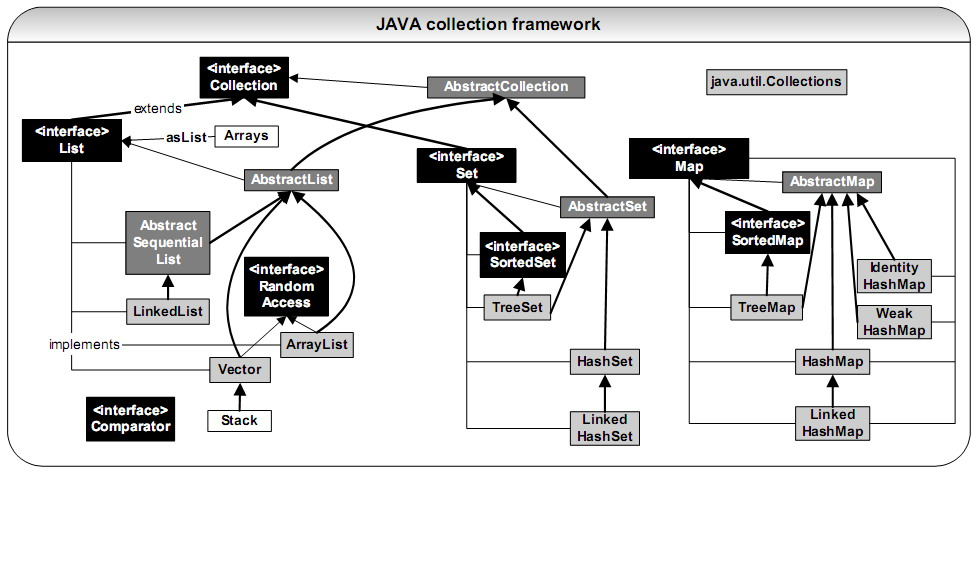
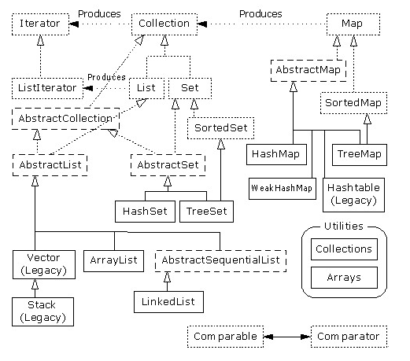
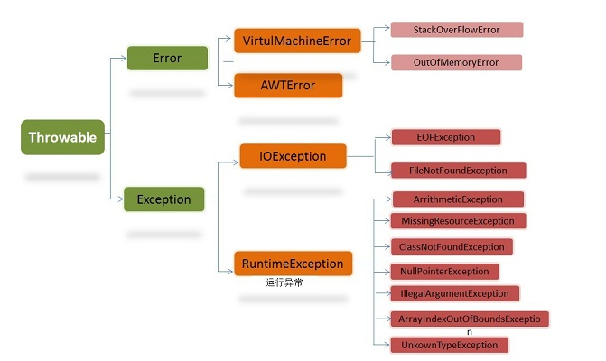
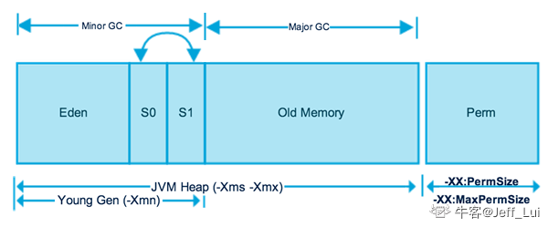

# java面试笔试

## JAVA中标识符

JAVA中,标识符, 指用于给变量.类.方法名 等命名的名称. 
1. 标识以**数字,字符,下划线,以及美元$符**组成.（不能包括@、%、空格等）,不能以**数字开头**. 
2. 不能与JAVA**关键字**重复 
3. 严格区分的大小写,（Flag和flag是两个变量）

## 容器集合类

## 修饰符abstract final 

### abstract final 

使用final修饰的类表示的是最终类，必须可以创建实例，不能被继承
抽象方法不能有方法体；即不能有{}只能有；
abstract类不能用final修饰
abstract方法需要被子类继承，不能使用private，可以使用public或protected
不能同时存在两个访问修饰符
由于private修饰的方法不能被子类实现

修饰方法：abstract不能与final,static,private共用
修饰外部类：abstract不能与final，static共用（外部类public修饰）
修饰内部类:abstract不能与final公用(内部类四个访问控制符都可以)

### abstract

abstract类中可以没有abstract方法，但是abstract方法必须在abstract类中或者接口中

抽象类可以有抽象方法和非抽象方法，非抽象类不可以有抽象方法。调用抽象类的方法时，必须要继承抽象类然后重写方法，所以不能把abstract和final，private,static一起使用。

###  abstract private

abstract修饰的类需要子类去继承，并重写其所有的抽象方法，非抽象方法直接继承。private成员不能被子类继承，毫无意义，所以不建议在abstract类中定义private成员

### static

类加载的时候，static属性比非static先初始化，所以static方法中不能处理非static的属性

### native

native修饰方法，native修饰的方法简单来说就是：一个Java方法调用了一个非Java代码的接口。
定义navtive方法时，并不提供实现体，因为其实现体是用非Java语言在外面实现的。**native可以和任何修饰符连用，abstract除外**。因为native暗示这个方法时有实现体的，而abstract却显式指明了这个方法没有实现体。
native是方法修饰符。Native方法是由另外一种语言（如c/c++，FORTRAN，汇编）实现的本地方法。因为在外部实现了方法，所以在java代码中，就不需要声明了，有点类似于接口方法。Native可以和其他一些修饰符连用，但是abstract方法和Interface方法不能用native来修饰。

**private修饰的东西**
1、本类的方法可以访问
2、反射也可以访问

### 访问权限修饰符

public：可以被所有其他类所访问;
protected：自身、**子类**及同一个包中类可以访问;
default：自身、同一包中的类可以访问;
private：只能被自己访问和修改。
public>protcted>default>priavte

default不能修饰变量
普通变量不能用abstract修饰，abstract一般修饰方法和类

**private final 区别**
说白了private方法只可以在类的内部使用，在类外根本访问不到， 而final方法可以在类外访问，但是不可以重写该方法，就是说可以使用该方法的功能但是不可以改变其功能，这就是private方法和final方法的最大区别

## 输入输出流

流分为节点流和处理流，而“基本的”是表示节点流

**节点流：**
FileInputStream，FileOutputStrean，FileReader，FileWriter
StringReader，StringWriter

ByteArrayInputStream ，ByteArrayOutputStream ，CharArrayReader

PipedInputStream PipedOutputStream PipedReaderPipedWriter

**处理流：**
BufferedInputStrean，BufferedOutputStream，BufferedReader，BufferedWriter 
InputStreamReader，OutputStreamReader

DataInputStream，DataOutputStream

PrintWriter

不知道大家发现没有，节点流的前缀都是名词，如File，String，Char等；处理流的前缀都是动词，如input，print，bufferd等等

## 异常

Thowable是java语言中所有的错误和异常的超类，继承自object java.lang.Thowable的两个子类是java.lang.error以java.lang.exception

error指代码发生严重错误无法修改，只能代码重写 

Exception又有分为运行时异常和非运行时异常， 运行时异常我们一般我们**建议修改代码**，不做异常处理所以我们又称作非受检异常…非运行时异常我们又称作受检异常，受检异常一定要处理，**要么抛出，要么try catch**.

受检异常处理方式
一: try catch:try 用于检测异常。异常之处后面的代码将不会执行。catch 是捕获异常，此时jvm会终止代码的执行，直到catch捕获相应的异常并处理时，try后面的代码才会继续执行

二:throws 表示谁调用谁处理，是一种处理方式 thow 表示自定义异常，必须间接或直接继承Exception,……eg: throw new myexception

## try-catch-finally 

try-catch-finally 规则( 异常处理语句的语法规则 ）
1)  必须在 try 之后添加 catch 或 finally 块。try 块后可同时接 catch 和 finally 块，但至少有一个块。

2) 必须遵循块顺序：若代码同时使用 catch 和 finally 块，则必须将 catch 块放在 try 块之后。
3) catch 块与相应的异常类的类型相关。
4) 一个 try 块可能有多个 catch 块。若如此，则执行第一个匹配块。即Java虚拟机会把实际抛出的异常对象依次和各个catch代码块声明的异常类型匹配，如果异常对象为某个异常类型或 其子类的实例，就执行这个catch代码块，不会再执行其他的 catch代码块
5) 可嵌套 try-catch-finally 结构。
6) 在 try-catch-finally 结构中，可重新抛出异常。
7) 除了下列情况，总将执行 finally 做为结束： JVM 过早终止（调用 System.exit(int)）；在 finally 块中抛出一个未处理的异常；计算机断电、失火、或遭遇病毒攻击

由此可以看出，catch只会匹配一个，因为只要匹配了一个，虚拟机就会使整个语句退出

## HttpServletResponse

HttpServletResponse完成：设置http头标，设置cookie，设置返回数据类型，输出返回数据；读取路径信息是HttpServletRequest做的

## 包

### java.lang

java.lang包包含
基本类型的包装类
String 类
Math 类     ——    包含函数
Class 类
Object 类
### java.utils

主要是集合类、时间处理模式、日期时间工具等各类常用工具包。

### java.concurrent

Semaphore：类，控制某个资源可被同时访问的个数;
ReentrantLock：类，具有与使用synchronized方法和语句所访问的隐式监视器锁相同的一些基本行为和语义，但功能更强大；
Future：接口，表示异步计算的结果;
CountDownLatch： 类，可以用来在一个线程中等待多个线程完成任务的类。

## 重载

方法名称相同，参数个数、**次序**、类型不同
因此重载对**返回值**没有要求，可以相同，也可以不同
但是如果参数的个数、类型、次序都相同，方法名也相同，仅返回值不同，则无法构成重载。

## Maven Ant

Ant和Maven都是基于Java的构建(build)工具。理论上来说，有些类似于（Unix）C中的make ，但没有make的缺陷。Ant是软件构建工具，Maven的定位是软件项目管理和理解工具。 

Ant特点
* 没有一个约定的目录结构
* 必须明确让ant做什么，什么时候做，然后编译，打包
* 没有生命周期，必须定义目标及其实现的任务序列
* 没有集成依赖管理

Maven特点 
* 拥有约定，知道你的代码在哪里，放到哪里去
* 拥有一个生命周期，例如执行 mvn install 就可以自动执行编译，测试，打包等构建过程
* 只需要定义一个pom.xml,然后把源码放到默认的目录，Maven帮你处理其他事情
* 拥有依赖管理，仓库管理

## final, finally, finalize的区别

final用于声明属性，方法和类，分别表示属性不可变，方法不可覆盖，类不可继承。
finally是异常处理语句结构的一部分，表示总是执行。
finalize是Object类的一个方法，在垃圾收集器执行的时候会调用被回收对象的此方法，可以覆盖此方法提供垃圾收集时的其他资源回收，例如关闭文件等。

## sleep() 和 wait() 有什么区别?
　　sleep是线程类（Thread）的方法，导致此线程暂停执行指定时间，给执行机会给其他线程，但是监控状态依然保持，到时后会自动恢复。调用sleep不会释放对象锁。
wait是Object类的方法，对此对象调用wait方法导致本线程放弃对象锁，进入等待此对象的等待锁定池，只有针对此对象发出notify方法（或not ifyAll）后本线程才进入对象锁定池准备获得对象锁进入运行状态。

## 接口

（1）接口用于描述系统对外提供的所有服务,因此接口中的成员常量和方法都必须是公开(public)类型的,确保外部使用者能访问它们；

（2）接口仅仅描述系统能做什么,但不指明如何去做,所以接口中的方法都是抽象(abstract)方法；

（3）**接口不涉及和任何具体实例相关的细节,因此接口没有构造方法,不能被实例化,没有实例变量，只有静态（static）变量**；

（4）接口的中的变量是所有实现类共有的，既然共有，肯定是不变的东西，因为变化的东西也不能够算共有。所以变量是不可变(final)类型，也就是常量了。

（5） 接口中不可以定义变量？如果接口可以定义变量，但是接口中的方法又都是抽象的，在接口中无法通过行为来修改属性。有的人会说了，没有关系，可以通过 实现接口的对象的行为来修改接口中的属性。这当然没有问题，但是考虑这样的情况。如果接口 A 中有一个public 访问权限的静态变量 a。按照 Java 的语义，我们可以不通过实现接口的对象来访问变量 a，通过 A.a = xxx; 就可以改变接口中的变量 a 的值了。正如抽象类中是可以这样做的，那么实现接口 A 的所有对象也都会自动拥有这一改变后的 a 的值了，也就是说一个地方改变了 a，所有这些对象中 a 的值也都跟着变了。这和抽象类有什么区别呢，怎么体现接口更高的抽象级别呢，怎么体现接口提供的统一的协议呢，那还要接口这种抽象来做什么呢？所以接口中 不能出现变量，如果有变量，就和接口提供的统一的抽象这种思想是抵触的。所以接口中的属性必然是常量，只能读不能改，这样才能为实现接口的对象提供一个统 一的属性。

通俗的讲，你认为是要变化的东西，就放在你自己的实现中，不能放在接口中去，接口只是对一类事物的属性和行为更高层次的抽象。对修改关闭，对扩展（不同的实现 implements）开放，接口是对开闭原则的一种体现。

## Java创建对象

(1) 用new语句创建对象，这是最常见的创建对象的方法。
(2) 运用反射手段,调用java.lang.Class或者java.lang.reflect.Constructor类的newInstance()实例方法。
(3) 调用对象的clone()方法。
(4) 运用反序列化手段，调用java.io.ObjectInputStream对象的 readObject()方法。

(1)和(2)都会明确的显式的调用构造函数 ；(3)是在内存上对已有对象的影印，所以不会调用构造函数 ；(4)是从文件中还原类的对象，也不会调用构造函数。

## JVM内存模型

Java 中的堆是 JVM 所管理的最大的一块内存空间，主要用于存放各种类的实例对象。
在 Java 中，堆被划分成两个不同的区域：新生代 ( Young )、老年代 ( Old )。新生代 ( Young ) 又被划分为三个区域：Eden、From Survivor、To Survivor。

新生代又分为eden、from_survivor和to_survivor，分配比例为8:1:1。

新生代和老年代之比为1:2

大部分新生对象都在eden中，当进行一次gc（垃圾回收）时，对象的年龄增加一岁，部分eden中存活对象会到from_survivor，部分from_survivor中存活的对象会到to_survivor中，部分to_survivor中的对象会到老年代中（默认15岁）。

## 包的作用

1、把功能相似或相关的类或接口组织在同一个包中，方便类的查找和使用。

2、如同文件夹一样，包也采用了树形目录的存储方式。同一个包中的类名字是不同的，不同的包中的类的名字是可以相同的，当同时调用两个不同包中相同类名的类时，应该加上包名加以区别。因此，包可以避免名字冲突。

3、包也限定了访问权限，拥有包访问权限的类才能访问某个包中的类。

Java 使用包（package）这种机制是为了防止命名冲突，访问控制，提供搜索和定位类（class）、接口、枚举（enumerations）和注释（annotation）等。

## 会话跟踪的机制

Cookies，URL重写，隐藏式表单域，Session机制

Cookies

Cookies是使用最广泛的会话跟踪机制，Cookies是有服务器创建，并把Cookies信息保存在用户机器上的硬盘上，下次用户再次访问该站点服 务器的时候，保存在用户机器上硬盘的Cookies信息就被送回给服务器。一般Cookies一般不多于4KB，且用户的敏感信息如信用卡账号密码不应该 保存在Cookies中。

URL重写

URL重用户在每个URL结尾附加标识回话的数据，与标识符关联的服务器保存有关与会话的数据，如我们访问某个新闻的时候，在地址栏我们一般会看到这样的 信息：http://www.XXX.com/news?id=??,通常的话id后面的问号表示该条新闻在后台数据库中的新闻表的id。URL重写能够 在客户端停用cookies或者不支持cookies的时候仍然能够发挥作用。

隐藏表单域

通常，在表单中我们使用隐藏表单域的时候会有这么一句代码：`<input type=”hidden” name=”XXX”  value=”XXX”/>`。通过给type属性赋值为hidden值来实现隐藏，这样用户在浏览的时候看不到这行代码的数据，但是当用户通过查看 源代码还是可以看到的。

Session机制

这个机制要慎用，特别是对于访问量很大的站点，因为这种机制是吧Session信息保存在服务器端。如果访问量特别大的话，对于服务器的承受力的要求有多高是可想而知的。

## 序列化

序列化保存的是对象的状态，静态变量属于类的状态，因此，序列化并不保存静态变量。
扩展：
①实例化：是把类创建为对象的过程。格式一般为:｛类名 对象名 = new 类名（参数1，参数2...参数n）构成｝，也就是new对象。
②序列化：将对象的状态信息转换为可以存储或传输的形式的过程(对象转化为字节序列的过程)。序列化期间，对象将其当前状态写入到临时或持久性存储区。
③反序列化:把字节序列恢复为对象的过程称为对象的反序列化。