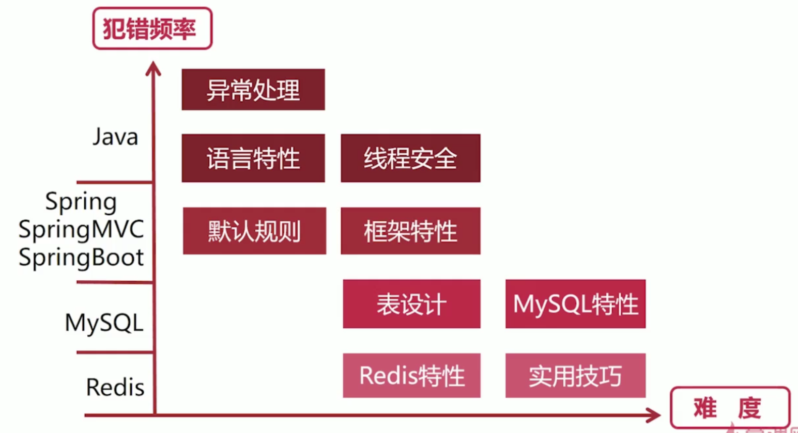

# Java实操必坑指南



## Java空指针和异常 - 常犯指数5星

1. 空指针解释（NullPointException-NPE）:
    空：内存地址为空-即无效地址
    指针：引用，指向一个实际对象
    异常：运行时异常，不需要捕获，造成程序中断
2. 造成NPE的原因 -- 对象未初始化就使用

    ```java
    1. 调用了空对象的属性
    User user = null;
    user.print();
    2. 访问了空对象的属性
    User user = null;
    System.out.println(user.name);
    3. 当数组时一个空对象时候，取它的长度
    String[] address;
    System.out.println(address.length);
    4. 自定义异常类,自定义异常没有初始化直接抛出引起
    即null当作Throwable的值
    public static class CustomException extends RuntimeException{}
    CustomException exception = null;
    throw exception;
    5. 方法的放回值是null,调用方直接去使用
    User user = new User();
    System.out.println(user.readBook().contains("MySQL"));
    ```

3. 避免NPE方法
    * 使用之前一定要初始化，或检查是否初始化
    * 尽量避免在函数中返回NULL,或给出详细的注释（良好的编程习惯）
    * 外部传值，除非有明确的说明（非NULL）,否则，一定要及时判断

4. 常见环境
    * 自动**拆箱**出现空指针 -- 拆箱本质是调用对象的value方法
        * 具体场景

            ```java
            1. 变量赋值自动拆箱出现的空指针
            Long count = null;
            long count_ = count;
        
            2. 方法传参时自动拆箱引发的空指针
            private static int add(int x, int y) {
                return x + y;
            }
            public static void main(String[] args) {
                Integer left = null;
                Integer right = null;
                System.out.println(add(left, right));
            }

            3. 用于大小比较的场景
            Long left = 10L;
            Long right = null;
            System.out.println(compare(left, right));
            ```

        * 如何规避
            1. 基本数据类型优于包装器类型，优先考虑使用**基本类型**
            2. 对于不确定的包装器类型，一定要校验是否是NULL
            3. 对应值为NULL的包装器类型，赋值为0
    * 字符串、数组、集合在使用时出现空指针
        * 具体场景

        ```java
        1. 字符串使用 equals 可能会报空指针错误
        private static boolean stringEquals(String x, String y) {
            return x.equals(y);
        }
        System.out.println(stringEquals(null, "xyz")

        2. 对象数组 new 出来, 但是元素没有初始化
        public static class User {
            private String name;
        }

        User[] users = new User[10];
        for (int i = 0; i != 10; ++i) {
            // users[i] = new User(); 每个对象初始化
            users[i].name = "imooc-" + i;
        }

        3. List 对象 addAll 传递 null 会抛出空指针
        addAll内部会执行 list.toArray() 方法
        List<User> users = new ArrayList<User>();
        User user = null;
        List<User> users_ = null;

        users.add(user);
        users.addAll(users_);
        ```
    * 使用Optional规避空指针
        * Optional解释
            `Optional<T>`是Java8 提供的一个泛型容器类
            含义:代表一个值存在与不存在
            作用:避免空指针异常
            可以看作:至多包含一个元素的集合
            不能作为类的字段使用，没有实现序列化接口
            在领域模型中应小心使用
        * Optional方法
            * empty()--创建一个空的Optional实例
            * of(T value)--将传入的值用Optional封装后返回，若传入null则抛出NPE
            * ofNullable(T value)--将传入的值用Optional封装后返回，若传入**null**，返回空Optional实例
            * get--获取 Optional 中存放的值，若不存在元素，抛出NoSuchElementException异常
        * Optional日常使用，规避空指针异常
            * orElse(new object())--存在即返回，空则提供默认值
            * orElsGet(() -> anoymos())--存在即返回，空则由函数去产生。在函数中修改，复用灵活
            * orElseThrow(RuntimeException::new)存在即返回，否则抛出异常
            * ifPresent(u -> System.out.println(u.getName()))--存在才去做相应处理
            * map(u -> u.getName()).orElse("anymos")--map 可以对Optional中的对象执行某种操作，且会返回一个 Optional 对象
            * map(u -> u.getName()).map(name -> name.length()).orElse(0)--map无限级联操作

## 异常

1. 异常解释（Exception）:
    Java通过异常机制处理运行期间发生的错误
2. 造成NPE的原因
    * 用户输入非法数据
    * 打开的文件不存在
    * 网络通信链接中断
    * JVM内存溢出

    ```java
    1. 调用了空对象的属性
    User user = null;
    user.print();
    2. 访问了空对象的属性
    User user = null;
    System.out.println(user.name);
    3. 当数组时一个空对象时候，取它的长度
    String[] address;
    System.out.println(address.length);
    4. 自定义异常类,自定义异常没有初始化直接抛出引起
    即null当作Throwable的值
    public static class CustomException extends RuntimeException{}
    CustomException exception = null;
    throw exception;
    5. 方法的放回值是null,调用方直接去使用
    User user = new User();
    System.out.println(user.readBook().contains("MySQL"));
    ```

3. 避免NPE方法
    * 使用之前一定要初始化，或检查是否初始化
    * 尽量避免在函数中返回NULL,或给出详细的注释（良好的编程习惯）
    * 外部传值，除非有明确的说明（非NULL）,否则，一定要及时判断

4. 常见环境