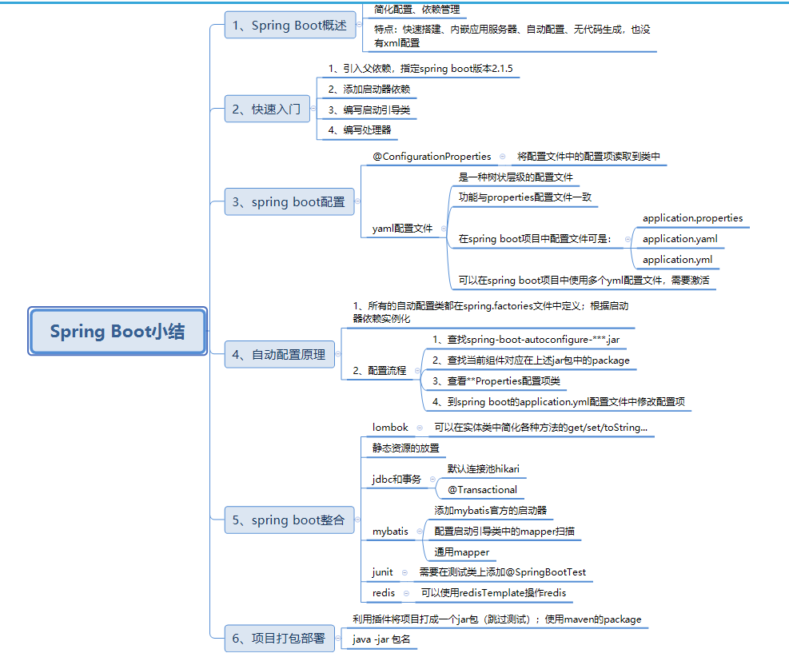
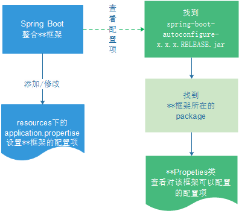
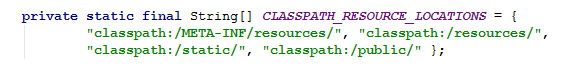
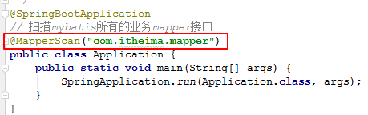

# Spring Boot

## 小结



## 目录

1. 配置文件添加
2. 配置文件修改
3. lombok
4. SpringMVC端口和静态资源、拦截器
5. 整合jdbc,数据源Hikari有jdbc依赖传递依赖
6. 事务@Transactional
7. dao层 MyBatis整合
8. 通用Mapper(不用编写sql，继承的Mapper接口中已经有实现)

## 原理

### 自动配置

pox.xml

* spring-boot-dependencies:核心依赖再父工程中
* 我们在写或者引入一些springboot依赖的时候，不需要指定版本，就是因为这些仓库

启动器spring-boot-starter-

* 启动器相当于Spring Boot的启动场景
* 比如spring-boot-starter-web,帮我们自动导入web环境的依赖！
* springboot将所有的功能场景，都变成一个个启动器
* 我们需要使用深恶

主程序启动  @SpringBootApplication

* 本质还是spring组件]

## 1. Spring Boot概述

**目标**：了解Spring Boot是什么，有什么作用

**小结**：

Spring Boot是一个便捷搭建 基于spring工程的脚手架；作用是帮助开发人员快速搭建大型的spring 项目。简化工程的配置，依赖管理；实现开发人员把时间都集中在业务开发上。

## 2. Spring Boot入门

**目标**：能够使用Spring Boot搭建项目

**分析**：

需求：可以在浏览器中访问`http://localhost:8080/hello`输出一串字符

实现步骤：

1. 创建工程；
2. 添加依赖（**启动器依赖**，spring-boot-starter-web）；
3. 创建启动类；
4. 创建处理器Controller；
5. 测试

**小结**：

Spring Boot工程可以通过添加启动器依赖和创建启动引导类实现快速创建web工程。

> spring-boot-starter-web默认的应用服务器端口是8080

## 3. Java代码方式配置

### 注解

@Configuration  配置文件类
@PropertySource("classpath:jdbc.properties")导入配置文件
@Value("${jdbc.password}") 获取配置文件属性
@Bean 配bean对象

**目标**：可以使用@Value获取配置文件配置项并结合@Bean注册组件到Spring

**分析**：

需求：使用Java代码配置数据库连接池，并可以在处理器中注入并使用

步骤：

1. 添加依赖；
2. 创建数据库；
3. 创建数据库连接参数的配置文件jdbc.properties；
4. 创建配置类；
5. 改造处理器类注入数据源并使用

**小结**：

```java
package com.itheima.config;

import com.alibaba.druid.pool.DruidDataSource;
import org.springframework.beans.factory.annotation.Value;
import org.springframework.context.annotation.Bean;
import org.springframework.context.annotation.Configuration;
import org.springframework.context.annotation.PropertySource;

import javax.sql.DataSource;

@Configuration
@PropertySource("classpath:jdbc.properties")
public class JdbcConfig {

    @Value("${jdbc.url}")
    String url;
    @Value("${jdbc.driverClassName}")
    String driverClassName;
    @Value("${jdbc.username}")
    String username;
    @Value("${jdbc.password}")
    String password;

    @Bean
    public DataSource dataSource(){
        DruidDataSource dataSource = new DruidDataSource();
        dataSource.setDriverClassName(driverClassName);
        dataSource.setUrl(url);
        dataSource.setUsername(username);
        dataSource.setPassword(password);
        return dataSource;
    }

}

```

## 4. Spring Boot属性注入方式

### 要点

@ConfigurationProperties（）---配置项类  @value需要为配置类配置每个配置文件的属性，**简化了在配置类中为配置文件属性加注解的操作**。创建一个配置项类，自动注入属性
@EnableConfigurationProperties(jdbcproperties.class)--配置类
@Bean获取数据源对象时候可以**在参数注入配置项类** 获取值时候调用getter方法
@ConfigurationProperties较@value可以实现松散绑定
@ConfigurationProperties（）和@Bean一起使用，不用创建配置项类。自动调用返回类对象的set方法和调用类对象的get方法

### 松散绑定Relaxed binding

* 不严格要求属性文件中的属性名和成员变量名一直，支持驼峰、中划线、下划线等待转换，甚至支持对象引导，比如：user.friend.name:代表的是user对象中的friend属性中的name属性，显然friend也是对象，@value：注解就难以完成这样的注入方式
* meta-data support:元数据支持，帮助IDE生成属性提示（写开源框架会用到）

**目标**：能够使用@ConfigurationProperties实现Spring Boot配置文件配置项读取和应用

**分析**：

需求：将配置文件中的配置项读取到一个对象中；

实现：可以使用Spring Boot提供的注解@ConfigurationProperties，该注解可以将Spring Boot的配置文件（**默认必须为application.properties或application.yml**）中的配置项读取到一个对象中。

实现步骤：

1. 创建配置项类JdbcProperties类，在该类名上面添加@ConfigurationProperties；
2. 将jdbc.properties修改名称为application.properties；
3. 将JdbcProperties对象注入到JdbcConfig；
4. 测试

**小结**：

* 使用@ConfigurationProperties编写配置项类将配置文件中的配置项设置到对象中

```java
@ConfigurationProperties(prefix = "jdbc")
public class JdbcProperties {

    private String url;
    private String driverClassName;
    private String username;
    private String password;

    public String getUrl() {
        return url;
    }

    public void setUrl(String url) {
        this.url = url;
    }

    public String getDriverClassName() {
        return driverClassName;
    }

    public void setDriverClassName(String driverClassName) {
        this.driverClassName = driverClassName;
    }

    public String getUsername() {
        return username;
    }

    public void setUsername(String username) {
        this.username = username;
    }

    public String getPassword() {
        return password;
    }

    public void setPassword(String password) {
        this.password = password;
    }
}

```

* 使用@ConfigurationProperties在方法上面使用

```java
    @Bean
    @ConfigurationProperties(prefix = "jdbc")
    public DataSource dataSource() {
        return new DruidDataSource();
    }
```

## 5. 多个yml文件配置

**目标**：可以将多个yml文件在application.yml文件中配置激活

**分析**：

yaml与properties配置文件**除了展示形式不相同**以外，其它功能和作用都是一样的；在项目中原路的读取方式不需要改变。

1）yml配置文件的特征：

1. **树状层级结构**展示配置项；
2. 配置项之间如果有关系的话需要**分行空两格**；
3. 配置项如果有值的话，那么需要在 `:`之**后空一格再写配置项值**；

将application.properties配置文件修改为application.yml的话：

```yml
jdbc:
  driverClassName: com.mysql.jdbc.Driver
  url: jdbc:mysql://127.0.0.1:3306/heima
  username: root
  password: root

key:
  abc: cba
  def:
    - g
    - h
    - j
```

2）多个yml配置文件；在spring boot中是被允许的。这些配置文件的名称必须为**application-`***`.yml**，并且这些配置文件必须要在application.yml配置文件中激活之后才可以使用。

3）如果properties和yml配置文件同时存在在spring boot项目中；那么这两类配置文件都有效。在两个配置文件中如果存在同名的配置项的话会**以properties文件的为主**。

**小结**：

在多个配置文件时，需要将这些文件在application.yml文件中进行激活：

```yml
#激活配置文件;需要指定其它的配置文件名称
spring:
  profiles:
    active: abc,def
```

## 6. 自动配置原理

**目标**：了解Spring Boot项目的配置加载流程

SpringBoot预先定义好整合类，pom文件添加依赖项目进行加载整合类

**寻找配置属性**：查看autoconfigure自动整合包，再寻找需要整合的组件package,再找它的properties

**小结**：

* 在 `META-INF\spring.fatories`文件中定义了很多自动配置类；可以根据在pom.xml文件中添加的 启动器依赖自动配置组件
* 通过如下流程可以去修改application配置文件，改变自动配置的组件默认参数



## 7. lombok应用

**目标**：使用lombok的注解实现pojo类的简化

**分析**：

使用Spring Boot整合SSM工程；需要使用到数据库数据。

* 将数据库表数据导入到数据库中（springboot_test）；

* 编写数据库表对应的实体类；一般情况下需要编写**get/set/toString**等这些方法会耗时并且会让实体类看起来比较臃肿。可以使用lombok插件对实体类进行简化。

  lombok是一个插件工具类包；提供了一些**注解@Data、@Getter**等这些注解去简化实体类中的**构造方法、get/set**等方法的编写。

  1. 在IDEA中安装lombok插件；
  2. 添加lombok对应的依赖到项目pom.xml文件；
  3. 改造实体类使用lombok注解

**小结**：

在Bean上使用：
@Data ：自动提供getter和setter、hashCode、equals、toString等方法
@Getter：自动提供getter方法
@Setter：自动提供setter方法
@Slf4j：自动在bean中提供log变量，其实用的是slf4j的日志功能。

## 8. Spring Boot整合-SpringMVC端口和静态资源

**目标**：可以修改tomcat的端口和访问项目中的静态资源

**分析**：

* 修改tomcat端口

  查询**Properties(配置项类)，设置配置项（前缀+类变量名）到application配置文件中

* 访问项目中的静态资源

  静态资源放置的位置；放置静态资源并访问这些资源

**小结**：

* 修改项目tomcat端口：

```yml
#tomcat端口
server:
  port: 80
```

* 在spring boot项目中静态资源可以放置在如下目录：

  

## 9.Spring Boot整合-SpringMVC拦截器

**目标**：可以在Spring Boot项目中配置自定义SpringMVC拦截器

**分析**：

1. 编写拦截器（实现HandlerInterceptor）；
2. 编写配置类实现 WebMvcConfigurer，在该类中添加各种组件；
3. 测试

**小结**：

可以在spring boot项目中通过配置类添加各种组件；如果要添加拦截器的话：

```java
package com.itheima.config;

import com.itheima.interceptor.MyInterceptor;
import org.springframework.context.annotation.Bean;
import org.springframework.context.annotation.Configuration;
import org.springframework.web.servlet.config.annotation.InterceptorRegistry;
import org.springframework.web.servlet.config.annotation.WebMvcConfigurer;

@Configuration
public class MvcConfig implements WebMvcConfigurer {

    //注册拦截器
    @Bean
    public MyInterceptor myInterceptor(){
        return new MyInterceptor();
    }

    //添加拦截器到spring mvc拦截器链
    @Override
    public void addInterceptors(InterceptorRegistry registry) {
        registry.addInterceptor(myInterceptor()).addPathPatterns("/*");
    }
}

```

## 10. Spring Boot整合-事务和连接池

**目标**：配置Spring Boot自带默认的hikari数据库连接池和使用@Transactional注解进行事务配置

**分析**：

* 事务配置
  1. 添加事务相关的启动器依赖，mysql相关依赖；
  2. 编写业务类UserService使用事务注解@Transactional
* 数据库连接池hikari配置

  只需要在application配置文件中指定数据库相关参数

**小结**：

* 事务配置；**只需要添加jdbc启动器依赖**
* 数据库连接池使用默认的hikari，在配置文件中配置如下：

```yml
spring:
  datasource:
    driver-class-name: com.mysql.jdbc.Driver
    url: jdbc:mysql://127.0.0.1:3306/springboot_test
    username: root
    password: root

```

## 11. Spring Boot整合-Mybatis

**目标**：配置Mybatis在Spring Boot工程中的整合包，设置mybatis的实体类别名，输出执行sql语句配置项

**分析**：

1. 添加启动器依赖；
2. 配置Mybatis：实体类别名包，日志，映射文件等；
3. 配置MapperScan

**小结**：

* 添加mybatis官方对于spring boot的一个启动器

  ```xml
          <!--mybatis -->
          <dependency>
              <groupId>org.mybatis.spring.boot</groupId>
              <artifactId>mybatis-spring-boot-starter</artifactId>
              <version>2.0.1</version>
          </dependency>
  
  ```

* 配置mybatis

  ```yml
  mybatis:
    # 实体类别名包路径
    type-aliases-package: com.itheima.pojo
    # 映射文件路径
    # mapper-locations: classpath:mappers/*.xml
    configuration:
      log-impl: org.apache.ibatis.logging.stdout.StdOutImpl
  ```

* 设置启动器类中的mapper扫描

  

## 12. Spring Boot整合-通用Mapper

**目标**：配置通用Mapper组件到Spring Boot项目中并使用Mapper`<T>`类

**分析**：

通用Mapper：可以实现自**动拼接sql语句**；所有的mapper都不需要编写任何方法也就是不用编写sql语句。可以提高开发效率。

1. 添加启动器依赖；
2. 改造UserMapper继承Mapper`<User>`；
3. 修改启动引导类Application中的Mapper扫描注解；
4. 修改User实体类添加jpa（javax.persistence annotation）注解,将数据库对应字段注入对应实体类的属性中；
5. 改造UserService实现业务功能；

## JPA注解

1. @Table(name="对应数据库表") -- 实体类 -- ORM将查询数据表对应到实体类中，字段名与属性名一致进行赋值
2. @Id -- 实体类的主键属性上 -- 设置主键
3. @KeySql(useGenerateKeys=true) -- 实体类的主键属性上-- **插入数据操作时返回ID**
4. @Column(name="") -- 属性上 --  处理名称不一致的属性匹配
5. @autowired自动寻找 接口的实现类

**小结**：

> 在启动引导类上面的mapper扫描注解 一定要修改为 通用mapper的扫描注解

## 13. Spring Boot整合测试

**目标**：可以访问处理器对应路径将数据库中的数据根据id查询

**分析**：

1. 改造HelloController，注入UserService利用其方法实现查询；
2. 启动项目进行测试 `http://localhost/user/用户id --> http://localhost/user/8`

**小结**：

修改了HelloController：

```java
    @Autowired
    private UserService userService;

    /**
     * 根据用户id查询用户
     * @param id 用户id
     * @return 用户
     */
    @GetMapping("/user/{id}")
    public User queryById(@PathVariable Long id){
        return userService.queryById(id);
    }

```

## 14. Spring Boot整合-Junit

**目标**：在Spring Boot项目中使用Junit进行单元测试UserService的方法

**分析**：

1. 添加启动器依赖**spring-boot-starter-test**；
2. 编写测试类

**小结**：

```java
@RunWith(SpringRunner.class)
@SpringBootTest
public class UserServiceTest {

    @Autowired
    private UserService userService;

    @Test
    public void queryById() {
        User user = userService.queryById(8L);
        System.out.println("user = " + user);
    }

    @Test
    public void saveUser() {
        User user = new User();
        user.setUserName("test2");
        user.setName("test2");
        user.setAge(13);
        user.setPassword("123456");
        user.setSex(1);
        user.setCreated(new Date());
        userService.saveUser(user);
    }
}
```

> 在Spring Boot项目中如果编写测试类则必须要在类上面添加@SpringBootTest

## 15. Spring Boot整合-redis

**目标**：在Spring Boot项目中使用Junit测试RedisTemplate的使用

**分析**：

1. 添加启动器依赖；spring-boot-starter-data-redis
2. 配置application.yml中修改redis的连接参数；（redis需要启动）
3. 编写测试类应用RedisTemplate操作redis中的5种数据类型（string/hash/list/set/sorted set）

**小结**：

```java
@RunWith(SpringRunner.class)
@SpringBootTest
public class RedisTest {

    @Autowired
    private RedisTemplate redisTemplate;

    @Test
    public void test(){
        //string 字符串
        //redisTemplate.opsForValue().set("str", "heima");
        redisTemplate.boundValueOps("str").set("heima");
        System.out.println("str = " + redisTemplate.opsForValue().get("str"));

        //hash 散列
        redisTemplate.boundHashOps("h_key").put("name", "heima");
        redisTemplate.boundHashOps("h_key").put("age", 13);
        //获取所有域
        Set set = redisTemplate.boundHashOps("h_key").keys();
        System.out.println(" hash散列的所有域：" + set);
        //获取所有值
        List list = redisTemplate.boundHashOps("h_key").values();
        System.out.println(" hash散列的所有域的值：" + list);

        //list 列表
        redisTemplate.boundListOps("l_key").leftPush("c");
        redisTemplate.boundListOps("l_key").leftPush("b");
        redisTemplate.boundListOps("l_key").leftPush("a");
        //获取全部元素
        list = redisTemplate.boundListOps("l_key").range(0, -1);
        System.out.println(" list列表中的所有元素：" + list);

        // set 集合
        redisTemplate.boundSetOps("s_key").add("a", "b", "c");
        set = redisTemplate.boundSetOps("s_key").members();
        System.out.println(" set集合中的所有元素：" + set);

        // sorted set 有序集合
        redisTemplate.boundZSetOps("z_key").add("a", 30);
        redisTemplate.boundZSetOps("z_key").add("b", 20);
        redisTemplate.boundZSetOps("z_key").add("c", 10);
        set = redisTemplate.boundZSetOps("z_key").range(0, -1);
        System.out.println(" zset有序集合中的所有元素：" + set);
    }
}

```

## 16. Spring Boot项目部署

**目标**：将Spring Boot项目使用maven指令打成jar包并运行测试

**分析**：

1. 需要添加打包组件将项目中的资源、配置、依赖包打到一个jar包中；可以使用maven的`package`；
2. 部署：java -jar 包名

**小结**：

* 添加打包组件

  ```xml
      <build>
          <plugins>
             <!-- 打jar包时如果不配置该插件，打出来的jar包没有清单文件 -->
              <plugin>
                  <groupId>org.springframework.boot</groupId>
                  <artifactId>spring-boot-maven-plugin</artifactId>
              </plugin>
          </plugins>
      </build>
  ```

* 部署运行

  ```sh
  java -jar 包名
  ```

## 17. 配置文件快速生成插件

JBLSpringBootAppGen-- application.java启动引导类 application.yml配置文件
