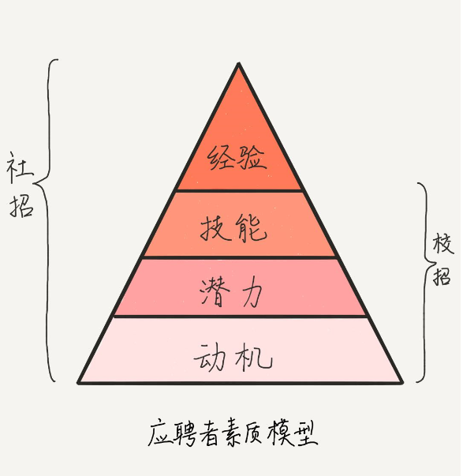

# 《面试现场》  音频笔记

## 音频基本信息
**作者**：白海飞

**专栏的目的**：
竖一面放大镜，带你看清自己的能力结构（而不仅仅只是关注技术层面），明白培养这些能力的关键因素，并且启发你在自身经历中寻找反映这些能力的素材和故事。
搭一座桥，一座在面试官和求职者中间，让沟通更直接、更到位的桥。让你能够分析面试问题的意图，用有价值、有亮点的经历或观点去回答，让面试官轻而易举地看出你的能力和价值。

**目录章节**：
1. **知彼篇**里，让应聘者明白面试官眼里的**人才素质模型**，这相当于面试的 **“考点大纲”** ；介绍公司整个招聘过程，带你了解面试中考查能力的一般方法，让你更容易理解**面试官的意图**。
在“知己篇”里，带你搞清楚什么是工作中**决定个人发展的关键因素**，进而明确自己该不该换工作；另一方面，明确自己的**职业愿景和规划**。准备一份详历，挖掘自己的能力、价值和亮点，并浓缩成一份受青睐的**简历**给面试官看。
2. **问答篇**里，和你分析面试中**常见的几类问题**，包括如何解释清楚一个技术点，如何体现你在项目中的重要性等等，帮助你回答得更加精准到位。
3. **贯通篇**里，重点分析几种**能力**：学习能力、精益能力、协作能力、管理和领导能力等等，这些能力都体现为解决问题的能力，目的是让你了解提高这些能力的关键因素，到详历中寻找合适的事例，全面精准地把你真实的能力水平展现给面试官。
4. **综合篇**里，盘点面试官和应聘者的认知偏差，强调双向选择中，帮你明确该如何**衡量新团队和新环境**，如何处理和**老东家的关系**，以及从**面试中学习**，为长远的发展提供动力。

## 知彼篇

### 01 | 公司到底想要什么样的人？

#### 公司眼中的好员工
* 看工作结果：
    * **个人工作结果质量好，价值高**。也就是说，工作结果在特性、性能、可靠性、易用性、可维护性、安全性等等方面符合要求，而且工作结果对客户来说有用，能给客户带来价值，能够解决用户的真正问题。比如，客户想要具有拍照美颜功能的拍照 App，而你实现的 App 仅能美颜已拍好的照片，这没有满足客户的需求，对客户不产生价值。

    * **带领别人做出成果**。这又分为三个层次，一是分享精力去帮助同事工作，二是分享技能帮助同事提升技能，授人以渔，三是分享自己的视野和观念，领导他人更快更好地工作。这样的影响力，使你能带动团队成员完成更多、更复杂、更有价值的工作。

* 看过程。
    同样一辆车，在公路上开，和在泥地上开，要达到相同的速度，付出的努力是不同的。同理，不同的工作环境和内容，带来不同的难度，对采用的技术和努力程度也有不同的要求。所以只衡量结果却不考虑过程，有失公平。考虑过程，就包括了对工作内容、环境因素带来的工作复杂度的衡量，也体现了对个人的技能、态度的衡量。

#### 信任感
**面试官还要进一步看应聘者的行为是否可以被预测**。也就是说，按照他现在表现出来的特质和能力，假如将来发生了某种状况，你能否预测出他的决定和行为。比如，即使工作出现了困难，但是你预测他有足够的经验和技能去应对；即使某种技能暂时不够，但是你预测他有潜力能快速提高；即使一件事情很麻烦，但是你预测他会不辞辛苦，认真对待。这种行为可被预测，就是要有信任感。

**信任感使你能预测对方将来的行为。**

如果要在短短的面试中，建立这种信任感，很有难度。但是，面试是建立信任的开端，信任形成得越快越牢固，越有利于合作，因此面试双方都应该在不违背诚信的原则下有效沟通，互相了解，形成互信。

#### 应聘者的素质模型

1. **经验（Experience）**
&ensp;&ensp;&ensp;&ensp;经验是指工作经历的对象和产出，体现为专业相关的知识和思维结构（Idea），用来指导思考和行为。
&ensp;&ensp;&ensp;&ensp;在众多的职位描述中，公司把经验要求写成“至少 3 年的 XXX 经验”，这种写法相当普遍，因为这基于一个普遍认知：一个智力中等的候选人，在一个技术拓展速度适中的工作中，3 年就可以达到独立、熟练工作的程度；如果是“5 年”，那就能带领别人完成工作了。

2. **技能（Skill）**
&ensp;&ensp;&ensp;&ensp;技能是做事的能力，体现一个人的专业性。技能可以让你基于已有的经验，运用新的工具、技术达成产出，形成新的经验。具体到软件产品研发领域，技能有技术、业务、管理等多个方面。技能和经验经常被放在一起谈：“3 年 Java 开发经验”是指经验，“精通 Java 多线程编程”是偏向技能。经验和技能，都是你习得的“现货”，但是技能分高低，表现在：
- 产生 idea 的技能：针对问题，基于经验，收集、理解、分析和制定新的方案（idea），涉及理解、思考、沟通等过程。

- 执行 idea 的技能：运用工具，把方案（idea）应用到实践，从而解决问题。除了用到理解、思考、沟通，还需要协作团队、管理资源，甚至领导和影响他人。

面试官希望，你库存的经验技能，与职位的要求匹配度越高越好，也就是所谓的“对口”。

“库存”不足，自然不能满足工作需求。但假如你的“库存”大过了该职位的问题域，公司需要提供“多余”的薪水，而且如果那部分超出的经验和技能，公司又用不上，就成资历过剩了，这时公司会有两点顾虑：一是公司提高了用人成本，二是员工屈才，工作稳定性不好。

3. **潜力（Potential）**
&ensp;&ensp;&ensp;&ensp;“潜力”，是增长经验和技能的能力。“潜力”在面试中被高频关注，因为当一个应聘者经验和技能不够职位要求时，我们会考虑他的潜力。如果他能很快提升技能达到要求，公司是乐意培养的。
&ensp;&ensp;&ensp;&ensp;关于潜力，面试官可以通过考察应聘者的学习、创新和精益能力来做判断。“学习”指的是从不会到会，掌握一项技能的过程；“创新”是针对特定场景创造新事物的技能；“精益”是把事情越做越好的技能。
&ensp;&ensp;&ensp;&ensp;如果你承认潜力，那么就说明你有成长型思维，有成长思维的人认为：技能是可以通过努力获得的，关键是要保持好奇心，平时爱思考、总结、尝试，愿意接受挑战，不怕错误和失败。因此，要在潜力上为自己的面试效果加分，你就需要注意如何在言谈及简历描述中体现这些特质。

4. **动机（Motivation）**
最下层是“动机”，指的是做事情的内心目标、意愿和态度。很多事情我们不是没有能力做，而是被不想做、觉得困难等心理因素扯了后腿，这就是动机不足。

因此，要想做成事儿，动机的作用非常重要。而且，“动机”决定着应聘者的潜力发挥、技能习得和经验形成，也就是说，动机决定着素质模型上面的三层。

动机的表现是什么呢？日本著名的企业家稻盛和夫在《干法》一书中，按动机区分了三类员工：
* **自燃型**，也就是自我驱动的员工，他们做事动机强烈，目标明确，明白任务的意义，甚至自己寻找有意义的事，满怀激情地投入，往往超出自己的工作范围，去推动进展，取得成果，然后又奔向下一个目标。“鸡血”满满有木有？
* 点燃型，这类员工需要一定的激励，需要他人帮助才能找到目标和意义，一旦“激活”就能像自燃型员工一样奋力工作。
* 阻燃型，这类员工当一天和尚撞一天钟，给多少钱，干多少活，按工作的最低标准和最后完成时间递交任务，跟同事合作差，不乐意分享，自我保护。

是什么因素决定动机。有什么因素呢？
* 人格品质，比如诚实守信、认真负责、坚毅勇敢等。这些从底层决定我们的做事动机。
* 职业价值观，就是在工作中区分是非、明确轻重的观念。比如，有人喜欢轻松安稳的工作，有人喜欢冒险和竞争；有人喜欢照章办事，有人则喜欢灵活自主；有人追求个人利益，有人则喜欢分享和帮助他人。

小提示：
不同的企业文化，对员工的职业价值观要求也不同。面试官希望你的职业价值观和团队文化一致，即所谓的“味道”相投。大家有相同的信条，才可以合作共事。

总体来说，在应聘者的素质模型中，经验、技能、潜力和动机是下层决定上层的关系。技能形成经验，潜力决定技能增长速度，动机又决定潜力、技能和经验的发挥。面试中对这四层的要求，因职位要求不同而不同。

如果是**招有经验的人**选，希望他入职后就能快速接手工作，会较多关注他的**经验和技能层面**。而对于**校园招聘**，因为学生普遍缺乏经验和技能，对其**动机和潜力等基本素质**的考查就成了重点。

#### 总结
* 公司到底想要什么样的人呢
    * 动机方面，公司更想要人品好，职业价值观和团队文化一致，职业性格和职位匹配的候选人；
    * 潜力方面，公司更想要学习、创新和精益能力好的候选人；
    * 技能和经验方面，公司想要和职位需求匹配的，如果你资历过剩，就要看公司发展需要了，如果你资历不够，那就要看你的潜力和动机了。

* 如何做
    * 了解面试官考查的各项内容和期待，做到“知彼”，不打无准备的仗；
    * 从个人经历中挖掘素材，突出契合职位需要的内容，以满足面试官的预期。

* 注意误区
    * 素质模型中的经验、技能和潜能，不仅仅是面试前要总结准备的，而是要在决定换工作时，甚至在制定职业规划时，更甚至在工作的每一天都要积累、总结、提高的；
    * 动机方面，不是要你在面试中“见风使舵”，靠套路和粉饰去迎合和敷衍。

* 几个面试问题，和应聘者素质模型对应起来。
    * “你觉得这个方案有什么地方可以改进？”
    * “这项新技术你是怎么精通的？”
    * “你对加班怎么看？”
    * “曾经被老板指出过什么问题吗？”
    * “你近期的困惑是什么？”